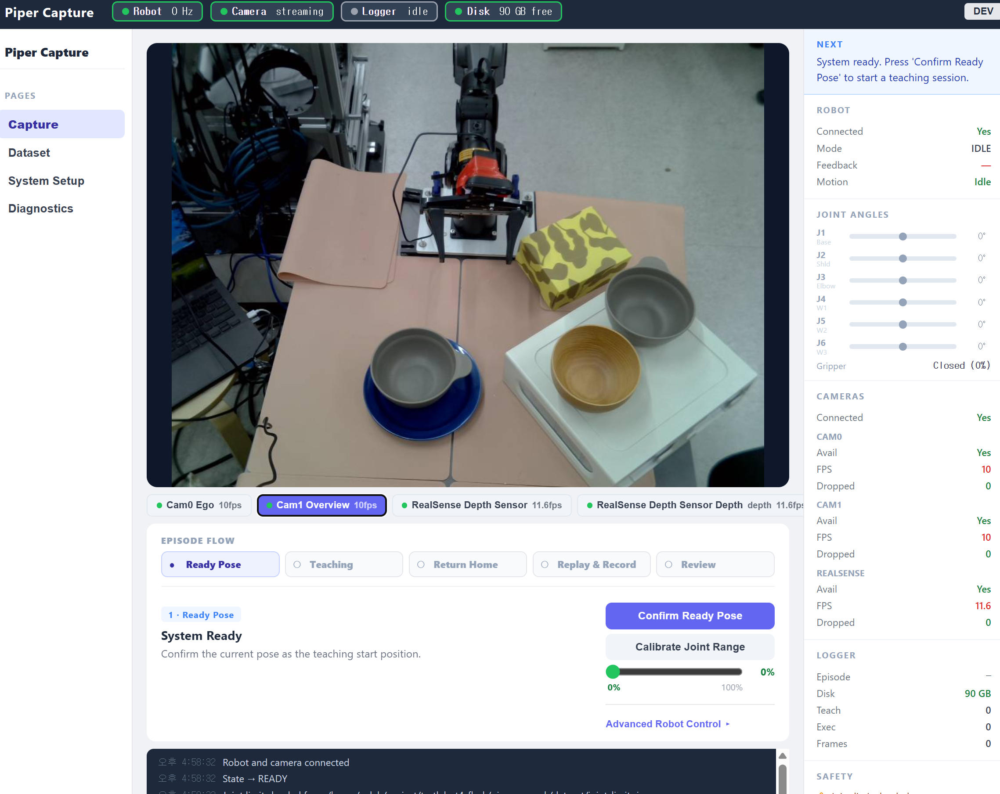
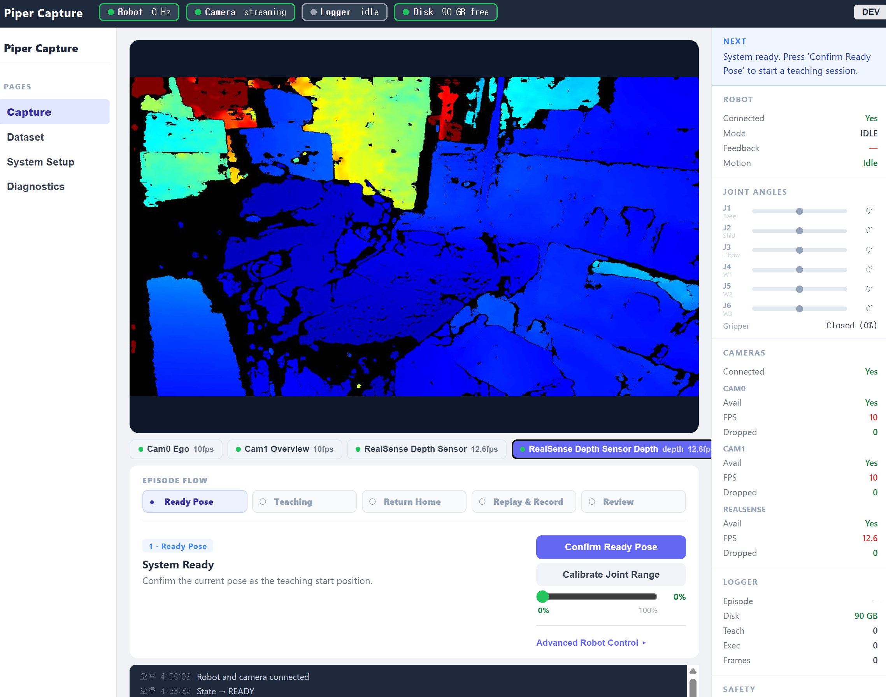
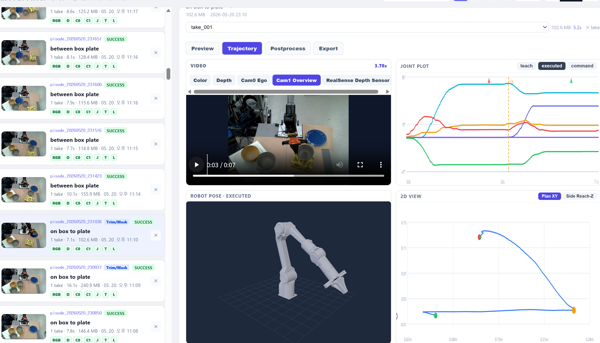

<div align="center">

# piper_cowork

**Kinesthetic teaching dataset generator for robot manipulation**

Record → Replay → Export — no teleoperation, no external controller.  
The operator physically guides the arm; the system handles everything else.

[](https://python.org)
[](https://flask.palletsprojects.com)
[](https://react.dev)
[](https://docs.ros.org/en/humble)
[](https://github.com/huggingface/lerobot)

<br/>

<video src="readme_static/piper_motion_execution.mp4" width="720" controls></video>

*AgileX Piper arm executing a replayed kinesthetic teaching trajectory*

</div>

---

## Overview

`piper_cowork` is a web-based platform for generating robot manipulation datasets via **kinesthetic teaching**. The operator holds the arm and demonstrates the task by hand — the system records joint trajectories and camera streams, replays the motion autonomously, and packages everything for imitation learning.

**Hardware**

| Component | Model | Interface |
|-----------|-------|-----------|
| Robot arm | AgileX Piper 6-DOF | CAN bus + ROS2 |
| Depth cam | Intel RealSense D4xx | USB3 — RGB + depth, 1280×720 |
| Overview cam | Logitech C270 (×2) | USB — side views |

**Output** — LeRobot v2.0 compatible (`observation.state`, `action`, `observation.images.*`, 224×224 @ 15 fps)

---

## Capture UI

<table>
<tr>
<td width="50%">

**RGB + Webcam live preview**



</td>
<td width="50%">

**Depth sensor live preview**



</td>
</tr>
</table>

The Capture page shows real-time streams from all cameras with per-camera FPS/drop counters, a live joint angle readout, and a step-by-step **Episode Flow** bar that guides the operator through the full record→replay cycle.

---

## Dataset Viewer

<video src="readme_static/dataset_viewer_robot_3d.mp4" width="720" controls></video>



The Dataset Viewer provides a **2×2 inspection panel** per take:

| Cell | Content |
|------|---------|
| **Video Cursor** | Replay video — scrubbing updates all other panels in sync |
| **Joint Plot** | teach / executed / command trajectories with time cursor |
| **Robot Pose** | Live 3D URDF model (drag to orbit, scroll to zoom) |
| **2D View** | Plan XY or Side Reach-Z end-effector path with skeleton |

Time correction is applied so executed/command trajectories are always aligned with the video timeline.

---

## Workflow

```
IDLE
 │
 ├─ connect ──────────────────────────────► READY
 │                                           │
 │                                   confirm ready pose
 │                                           │
 │                                     TEACH_READY
 │                                           │
 │                                    start teaching
 │                                           │
 │                                   TEACH_RECORDING   ← operator guides arm by hand
 │                                           │
 │                                    stop teaching
 │                                           │
 │                                   TRAJECTORY_CHECK  ← review, accept or discard
 │                                           │
 │                                      return home ──── backtrace (reverse teach)
 │                                           │       └─── direct (SAFE_RETURN_WAYPOINTS)
 │                                     REPLAY_READY
 │                                           │
 │                                    start replay
 │                                           │
 │                                   REPLAY_RECORDING  ← arm replays, cameras record
 │                                           │
 │                                    stop replay
 │                                           │
 │                                        REVIEW ──── save (success / failure)
 │                                                └─── discard / retake / re-teach
 └──────────────────────────────────────────────────────────────────────────────────►
```

Each **episode** is one task (e.g. *"pick red cup"*). Each **take** is one teach→replay attempt within that episode. Multiple takes can be recorded before saving.

---

## Setup

### Requirements

```bash
# ROS2 Humble + piper_ros driver (CAN bus)
pip install flask flask-socketio flask-cors \
            pyrealsense2 opencv-python scipy numpy pandas \
            imageio-ffmpeg pillow
```

### Configuration

Edit `config.py` before first run:

```python
# Measure on your physical robot:
#   ros2 topic echo /joint_states_single --once
SAFE_RETURN_WAYPOINTS = [
    [q1, q2, q3, q4, q5, q6],   # clearance pose  (EE above table)
    [q1, q2, q3, q4, q5, q6],   # ready pose      (task start position)
]
```

Without `SAFE_RETURN_WAYPOINTS` the automatic home return is disabled — the operator must manually reset the arm between takes.

### Run

```bash
cd piper_cowork
./start.sh
# ──► https://<host>:5002          desktop UI
# ──► https://<host>:5002/mobile   touch-optimized mobile UI
```

The server uses self-signed TLS (`cert.pem` / `key.pem`). Accept the browser warning on first visit.

---

## Dataset Format

### Raw (per take)

| File | Content | Rate |
|------|---------|------|
| `teach_joint.csv` | `t_host_ns, q1–q6, gripper` — kinesthetic recording | 50 Hz |
| `executed_joint.csv` | Actual joint states during replay | 50 Hz |
| `replay_command.csv` | Commands sent to driver during replay | 50 Hz |
| `camera_frames_*.csv` | Per-camera frame timestamps + index | capture FPS |
| `events.json` | Gripper transitions, state changes, errors | — |
| `video_*.mp4` | Speed-adjusted replay video (teach-duration aligned) | 10–30 fps |

### LeRobot v2.0 Export

Select episodes in the Dataset page and click **↓ LeRobot ZIP**, or run:

```bash
python -m converters.lerobot_converter --episode episode_YYYYMMDD_HHMMSS
```

| Column | Shape | Description |
|--------|-------|-------------|
| `observation.state` | `[7]` float32 | q1–q6 (rad) + gripper (m) |
| `action` | `[7]` float32 | same as state (position-control demo) |
| `observation.images.*` | `[224,224,3]` | webcam_0 / webcam_1 @ 15 fps |
| `timestamp` | float32 | seconds from episode start |

Trimming: episode ends 1 s after the first gripper-open event past 10 s.  
Time correction: executed joint timestamps are linearly scaled to match video duration.

---

## Architecture

```
piper_cowork/
├── app.py                    Flask + SocketIO entry point (port 5002)
├── controller.py             State machine — IDLE → … → SAVED
├── config.py                 All tuneable parameters
├── camera_manifest.py        Multi-camera registry
├── start.sh                  CAN setup + ROS2 + Flask launcher
│
├── nodes/
│   ├── piper_node.py         Teach / replay / home (ROS2 node)
│   ├── realsense_node.py     RealSense color + depth stream
│   ├── webcam_node.py        Logitech C270 frame capture
│   └── camera_manager.py    Multi-camera coordinator
│
├── storage/
│   ├── episode_manager.py    Episode/take lifecycle, CSV + video save
│   └── aligner.py            Timestamp-align joint + camera streams
│
├── routes/
│   ├── capture_routes.py     /api/connect, /api/teach/*, /api/replay/*
│   ├── episode_routes.py     /api/episodes/ — list, save, export
│   ├── robot_routes.py       /api/robot/gripper/*, /api/robot/status
│   ├── mask_routes.py        /api/masks/ — object mask library
│   ├── camera_routes.py      /api/cameras/ — manifest, frame preview
│   └── urdf_routes.py        /api/urdf/ — URDF + STL mesh serving
│
├── converters/
│   └── lerobot_converter.py  → LeRobot v2.0 (parquet + video)
│
├── kinematics/               Forward kinematics (FK) for trajectory view
│
├── frontend/                 React 18 + TypeScript web UI
│   └── src/
│       ├── pages/
│       │   ├── CapturePage.tsx    Desktop workflow UI
│       │   ├── DatasetPage.tsx    Dataset browser, viewer, export
│       │   └── MobilePage.tsx     Touch-optimized UI
│       └── components/
│           └── PiperRobotViewer.tsx  Three.js URDF 3D viewer
│
└── dataset/                  Recorded episodes (git-ignored)
    └── episode_YYYYMMDD_HHMMSS/
        ├── meta.json
        └── takes/
            └── take_001/
                ├── teach_joint.csv
                ├── executed_joint.csv
                ├── camera_frames_*.csv
                ├── frames_*/            color_*.jpg + depth_*.png
                └── video_*.mp4
```

---

## Key Parameters

| Parameter | Default | Description |
|-----------|---------|-------------|
| `TEACH_LOG_HZ` | 50 | Joint recording frequency (Hz) |
| `REPLAY_DEFAULT_SPEED` | 0.3 | Initial replay speed (30% of teach) |
| `GRIPPER_OPEN_RAD` | 0.07 | Full open position (rad) |
| `GRIPPER_CLOSE_RAD` | 0.0 | Full closed position (rad) |
| `GRIPPER_STEPS` | 8 | Actuation sub-steps (deadband workaround) |
| `GRIPPER_MID` | 0.022 | Open/closed threshold (rad) |
| `REALSENSE_FPS` | 10 | RealSense capture rate |
| `REALSENSE_RESOLUTION` | 1280×720 | Color + depth resolution |
| `SAFE_RETURN_WAYPOINTS` | `None` | Home return waypoints — **must set manually** |

---

## Notes

**No teleoperation required.** Motor torque is disabled (freedrive) during teaching. The operator moves the arm by hand.

**Replay is deterministic.** The smoothed teach trajectory replays at configurable speed. Executed joints are logged separately from commands for quality analysis.

**Safe return is path-safe.** Home is reached via a verified waypoint sequence, not a single target, to prevent mid-path collisions.

**Multi-take workflow.** If a take fails, the operator can re-teach, re-replay, or just record another take — all within one episode before labeling success/failure.
